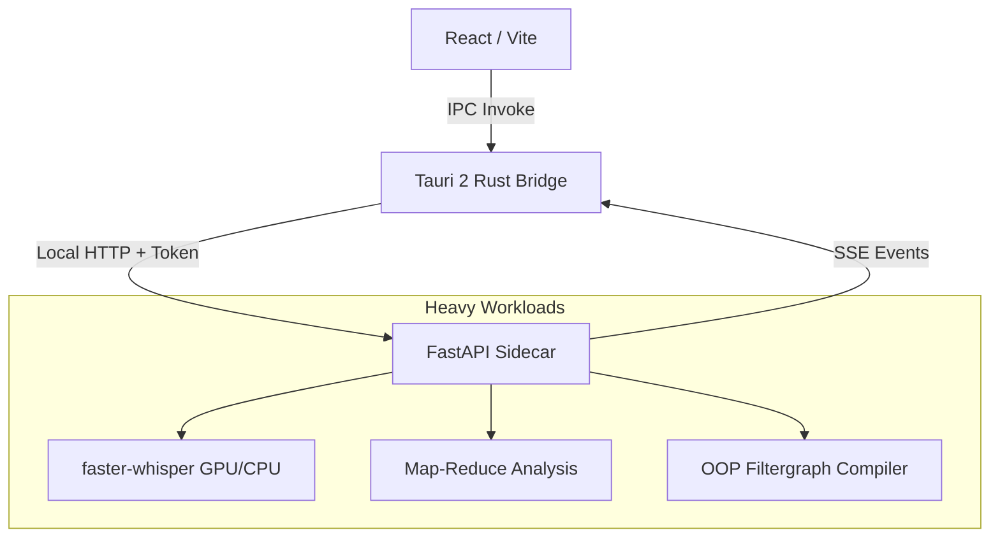

# Hustler: Autonomous YouTube Shorts Production Pipeline


Hustler is a high-performance, locally-hosted Windows desktop application engineered to automate the end-to-end production of YouTube Shorts. By integrating trend analysis, AI-driven semantic transcription, structured script generation, and template-based deterministic video rendering, Hustler guarantees a total production SLA of **< 15 minutes** from topic selection to a published-ready MP4 artifact.

## 🏗️ System Architecture

Hustler employs a strictly decoupled, **"Thin Client, Heavy Sidecar"** architecture to guarantee maximum performance without blocking the UI thread. 

1. **The Shell (Rust/Tauri 2)**: Acts purely as an IPC bridge and window manager. The React frontend interacts with the system exclusively through Tauri `invoke` commands. Direct network calls from the UI are strictly prohibited via CSP.
2. **The Core Engine (Python 3.12 / FastAPI)**: A local sidecar process running on `127.0.0.1` managing all I/O, heavy computation, and state. 
3. **Data Layer (SQLite WAL)**: Optimized for highly concurrent reads from the UI while background processes write via a strict `WriterQueue`.
4. **Render Engine**: An Object-Oriented Filtergraph Compiler that validates and dynamically constructs `ffmpeg` commands without manual string manipulation.



## ⚙️ Core Engineering Principles

- **Zero-Network UI:** The React frontend makes exactly 0 HTTP requests. All external state is managed by the Python sidecar and streamed back via Server-Sent Events (SSE) routed through Tauri Channels.
- **Contract-First Development:** Pydantic is the single source of truth. JSON Schemas and TypeScript types are automatically generated. There is no manual duplication of data models.
- **Circuit Breakers & Graceful Degradation:** Hardware profiling automatically detects CUDA availability. If GPU acceleration is missing, Whisper falls back to a CPU budget with strict timeout circuit breakers to protect the 15-minute SLA.
- **Idempotency & Resilience:** All background tasks (Transcription, API calls, Rendering) are idempotent and support cancellation (`DELETE /tasks/id`). Orphaned sidecars are automatically reaped via Windows Job Objects.

## 🚀 The Pipeline (Map-Reduce & OOP Rendering)

1. **Ingestion & Scoring:** yt-dlp fetches raw data; mathematical scoring algorithms rank the Top 20 trending videos in a given niche.
2. **Semantic Transcription:** `faster-whisper` transcription pipeline.
3. **Map-Reduce Analysis:** To bypass LLM context limits and hallucination, transcripts are asynchronously mapped into semantic "Summary Cards" and then reduced into a single structured schema.
4. **OOP Filtergraph Compiler:** Template JSONs are strictly validated against versioned schemas. A custom Python compiler translates `Timeline` logic into optimal FFmpeg filtergraphs (`xfade`, `zoompan`) bypassing error-prone manual bash strings.

## 🛠️ Tech Stack

- **Frontend:** React, Vite, TypeScript (Strict), TailwindCSS, TanStack Query.
- **Backend:** Python 3.12, FastAPI, Pydantic v2, `structlog` (JSON structured logging).
- **Desktop/Shell:** Rust, Tauri v2.
- **Database:** SQLite3 (WAL mode, custom `WriterQueue`).
- **AI / Media:** `faster-whisper`, `ElevenLabs TTS`, `FFmpeg` (Libx264, NVENC).
- **Tooling:** `uv` (Python dependency management), `pnpm`, `cargo`, `just`.

## 📚 Documentation

Detailed architectural decisions, coding protocols, and the active development roadmap are tracked inside the repository:
- [Architecture & Protocols](./MIMARI_VE_PLAN.md)
- [Coding Milestones & Tasks](./KODLAMA_YOL_HARITASI_TUM_ASAMALAR.md)

## 🏁 Getting Started (Development)

The project is currently in the **M0: Walking Skeleton** phase. 

```bash
# 1. Install dependencies
pnpm install
uv sync

# 2. Run quality gates (Lint, Typecheck, Test)
just check

# 3. Start development server (Tauri + FastAPI)
just dev
```

*Note: This software is intended for personal/internal usage and relies on proper credential management (Windows Credential Manager) for API keys.*
